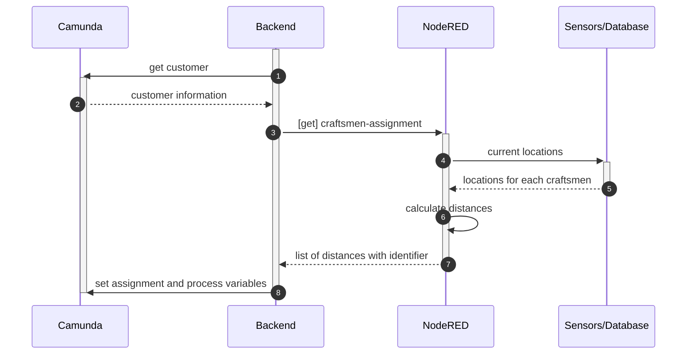

```mermaid
sequenceDiagram
    autonumber
    participant Camunda
    participant Backend
    participant NodeRED
    participant Sensors/Database
    activate Camunda
    activate Backend
    Backend->>+Camunda: get customer
    Camunda-->>Backend: customer information
    Backend->>+NodeRED: [get] craftsmen-assignment
    NodeRED->>+Sensors/Database: current locations
    Sensors/Database-->>-NodeRED: locations for each craftsmen
    NodeRED->>NodeRED: calculate distances
    NodeRED-->>-Backend: list of distances with identifier
    Backend->>Camunda: set assignment and process variables
    deactivate Camunda
    deactivate Backend
```