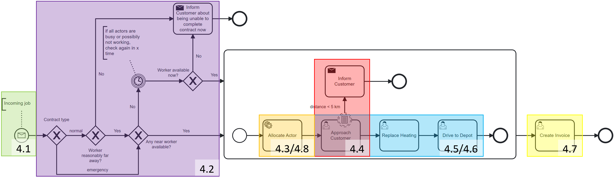
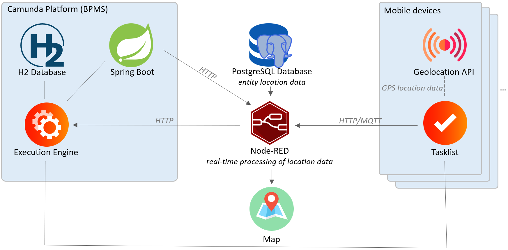

A Generic Approach towards Location-aware Business Process Execution Leo Poss, Stefan Schönig

> The following code shows a prototypical implementation, there might be bugs, and the code is not production-ready. The code is provided as-is and without any warranty. The code is licensed under the [MIT License](./LICENSE).

## Introduction

This repository contains a prototypical implementation of the concepts described in the paper "A Generic Approach towards Location-aware Business Process Execution" by Leo Poss and Stefan Schönig. In this publication, we describe a set of concepts for the use of location data in business process management.

## Concepts

The concepts are described in the paper. The following is a short summary of the concepts:

- Automatic start of process instances: The process instance is started automatically when the actor reaches the customer's location.
- Decision-making based on location data: Based on the actors' location, different decisions can be made in the process. 
- Location-based task allocation: The actor is allocated to the customer based on the distance between the actor and the customer.
- Location-based monitoring of tasks: 
- Location-based event dispatching: The customer is notified when the actor is approaching the customer's location.
- Location-based automatic completion of tasks: The task is automatically completed when the actor is arriving at or moving away from the customer's location.
- Location-based automation of tasks: Historic data and customer-specific data can be used to automate the task and improve future executions. 
- Location-based worklist reordering: Based on the distance between at least one actor and the customer, the worklist is reordered to show the tasks with the shortest distance first.

## Architecture

The repository is divided into three parts:

1. The `camunda` folder contains a Camunda BPM distribution with the concepts implemented as part of the surrounding [SpringBoot](https://spring.io/) application (available at http://localhost:8080).
2. The `NodeRED` folder contains the middleware, implemented in [NodeRED](https://nodered.org/), used to simulate the different actors and their locations (available at http://localhost:1880).
3. The `frontend` folder contains the prototype for a Webfrontend implemented using [SvelteKit](https://kit.svelte.dev/) connecting the BPMS and its implementation for the process and the middleware (available at http://localhost:5173).

## Usage
1. Start Camunda BPM by running `gradle bootRun` in the `Camunda` folder
2. Start the middleware by running `node-red` in the `NodeRED` folder after globally installing node-red and the needed worldmap extension
3. Start the frontend by running `npm run dev`/`yarn dev`/`...` in the `frontend` folder after installing the needed dependencies
4. The application is now up and running
   - After logging into camunda with the credentials `demo/demo`, the process model can be started by clicking on the `Start Process` button
   - The middleware can be used to simulate the different actors and their locations, as well as another visualization of all current locations at http://localhost:1880/worldmap. The initial variable setup gets triggered automatically when NodeRED is started after Camunda is already up and running. Both other injection points are used to simulate the position of one actor. The payload corresponds to the allocated actor and has to be changed accordingly to see results. After the actor reached the customer's location and starts, the other injection can be used to simulate the actor moving away, which will trigger the automatic completion of the task. For simplicity, all customer data is stored in memory and is not persisted.
   - The frontend is used to get a sorted task list showing all tasks sorted by their distance or driving to the current location of the user as well as a map showing the current location of the user and the locations of the different actors